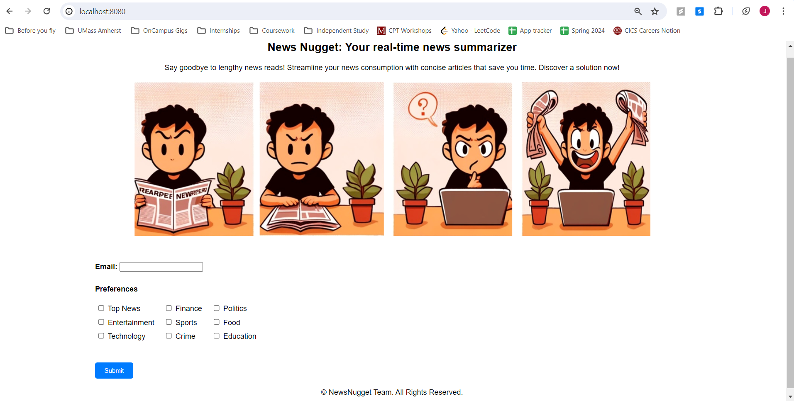

<!-- PROJECT LOGO -->
<br />
<p align="center">
  <a href="https://github.com/jashdalal/NewsNugget">
    
  </a>

  <h3 align="center">News Nugget</h3>

  <p align="center">
    A real-time news summarizer and preference-based notification app!
    <br />
    <br />
    <br />
    <a href="https://github.com/jashdalal/NewsNugget/blob/master/README.md">View Demo</a>
    ·
    <a href="https://github.com/jashdalal/NewsNugget/issues">Report Bug</a>
    ·
    <a href="https://github.com/jashdalal/NewsNugget/pulls">Contribute</a>
  </p>
</p>


<!-- TABLE OF CONTENTS -->
<details open="open">
  <summary>Table of Contents</summary>
  <ol>
    <li>
      <a href="#about-the-project">About The Project</a>
      <ul>
        <li><a href="#built-with">Built With</a></li>
      </ul>
    </li>
    <li>
      <a href="#getting-started">Getting Started</a>
      <ul>
        <li><a href="#prerequisites">Prerequisites</a></li>
        <li><a href="#execution">Installation</a></li>
      </ul>
    </li>
    <li><a href="#roadmap">Roadmap</a></li>
    <li><a href="#contributing">Contributing</a></li>
    <li><a href="#license">License</a></li>
    <li><a href="#contact">Contact</a></li>
  </ol>
</details>


<!-- ABOUT THE PROJECT -->
## About The Project

  <a></a>


The project creates a real-time news aggregation and summarization platform that delivered curated news notifications based on user preferences. PySpark was leveraged for parallel processing, and Apache Kafka was set up for news curation, ensuring scalability and efficient handling of large datasets from the NewsData.io API. Using the FlanT5 model, articles were categorized and summarized, enhancing user experience. News Nugget is a fully-functional application that listens for the latest news, processes these articles, and then delivers curated news notifications to the users based on their preferences.

### Built With

This section should list any major frameworks that you built your project using. Leave any add-ons/plugins for the acknowledgements section. Here are a few examples.
* Node.js
* MongoDB
* PySpark
* Kafka
* Flan-T5 Model
* REST APIs


<!-- GETTING STARTED -->
## Getting Started

To get a local copy up and running follow these simple example steps.

### Prerequisites

This is a list of things before running Flashfeed.
1. Install node from [https://nodejs.org/en/](https://nodejs.org/en/)
2. Install NPM packages
   ```sh
   npm init -y
   npm install express body-parser mongoose
   npm install express body-parser --save
   ```

### Execution

1. Set User Preferences
   ```
   To run the frontend-app
   npm install -g http-server
   http-server -c-1
   Run http://127.0.0.1:8080

   To run the backend-app
   node server.js
   
   ```
  
2. Start Kafka Server
   ``` 
   bin/zookeeper-server-start.sh config/zookeeper.properties
   bin/kafka-server-start.sh config/server.properties
   ```

3. News API Listener (Kafka Producer)
    ```    
    python producer.py
    ```

4. User Notification Generator (Kafka Consumer)
    ```
    python consumer.py
    ```


<!-- ROADMAP -->
## Roadmap

See the [open issues](https://github.com/jashdalal/NewsNugget/issues) for a list of proposed features (and known issues).


<!-- CONTRIBUTING -->
## Contributing

Contributions are what make the open source community such an amazing place to be learn, inspire, and create. Any contributions you make are **greatly appreciated**.

1. Fork the Project
2. Create your Feature Branch (`git checkout -b feature/AmazingFeature`)
3. Commit your Changes (`git commit -m 'Add some AmazingFeature'`)
4. Push to the Branch (`git push origin feature/AmazingFeature`)
5. Open a Pull Request


<!-- LICENSE -->
## License

Distributed under the MIT License. See `LICENSE` for more information.


<!-- CONTACT -->
## Contact

1. Jash Mitesh Dalal - [@jmdalal](https://www.linkedin.com/in/jmdalal/) - jdalal@umass.edu
2. Dhrumeen Patel - [@dhrumeenpatel](https://www.linkedin.com/in/dhrumeenpatel/) - dhrumeenkish@umass.edu
3. Poojitha Penta - [@poojithapenta](https://www.linkedin.com/in/poojithapenta/) - ppenta@umass.edu
4. Sahil Gupta - [@sahilgupta17](https://www.linkedin.com/in/sahilgupta17/) - sahgupta@umass.edu

